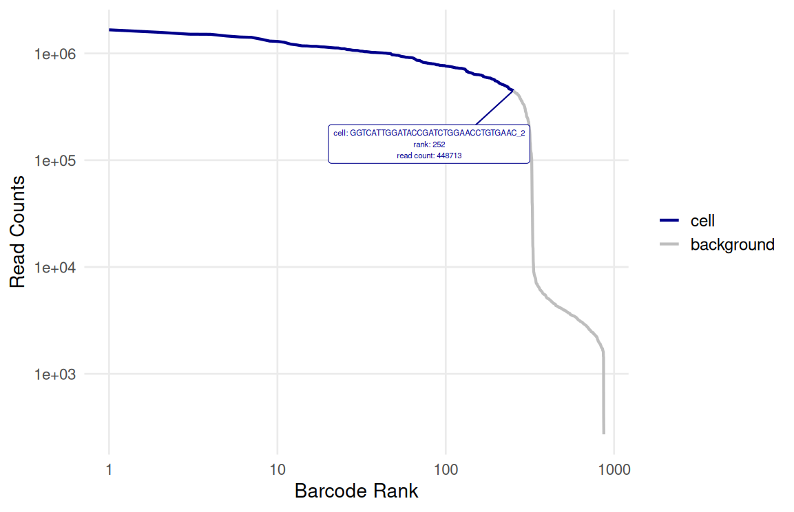
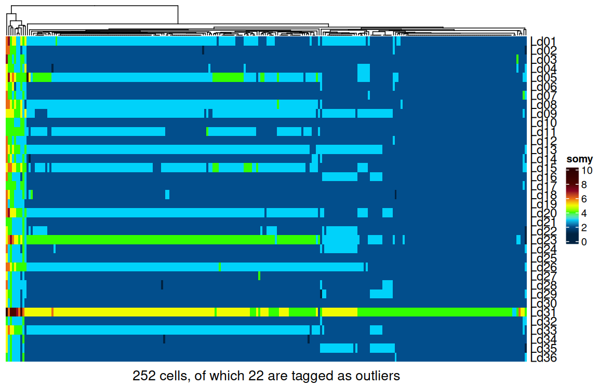
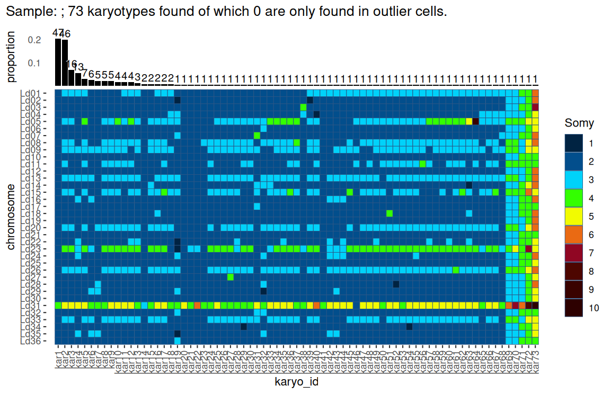
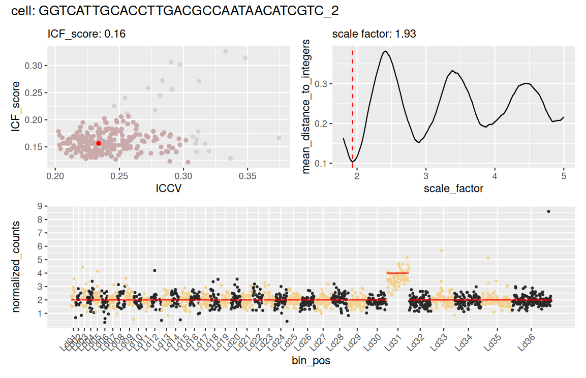
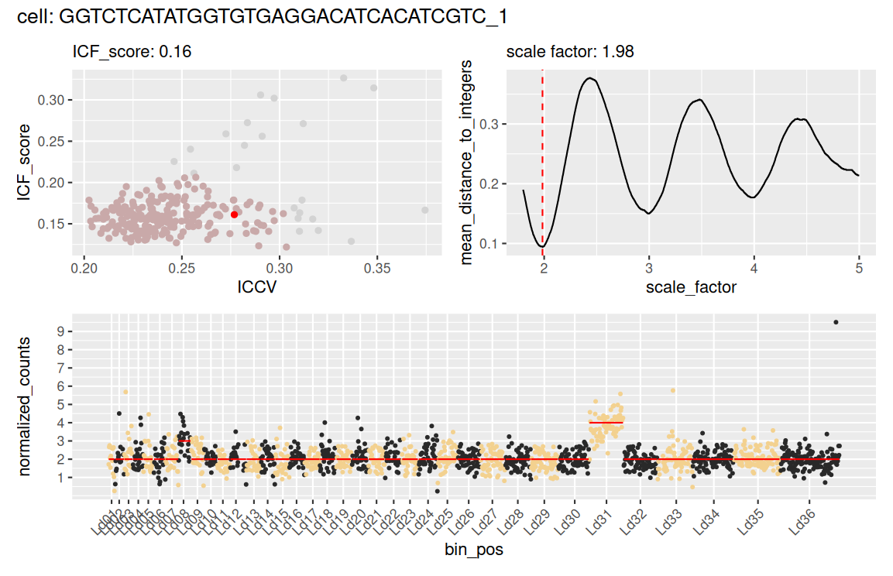

# Introduction
This repository contains the main scripts I use for analysis of single-cell DNA data. It is meant for personal use but can be used by anyone interested. 

# Usage

## The scDNA_functions.R script
The `scDNA_functions.R` script is the main script of this repo. It contains a series of functions to help analysing single cell DNA data.
### prepare environment
1) Start by cloning the repository:
```sh
git clone git@github.com:gabrielnegreira/scDNA_tools
```

2) In R, install the required packages:
```R
# Install CRAN packages
cran_packages <- c(
  "matrixStats",
  "dplyr",
  "tidyr",
  "tibble",
  "forcats",
  "ggplot2",
  "plotly",
  "mgcv",
  "ggrepel",
  "patchwork",
  "hues",
  "mixtools"
)

install.packages(cran_packages)

# Install Bioconductor package manager if needed
if (!requireNamespace("BiocManager", quietly = TRUE)) {
  install.packages("BiocManager")
}

# Install Bioconductor packages
bioc_packages <- c("rhdf5")
BiocManager::install(bioc_packages)
```

3) load the functions:
```R
source("scDNA_functions.R")
```
### Creating the scDNAobj object
To do the analysis, we first need to create a `scDNAobj` object. It is basically a list which stores all the data. It is not (yet) a formal S4 object!
 
#### Creating the scDNAobj object from a cellranger-dna output:
This repo was originaly designed to work with the output of [cellranger-dna](https://github.com/10XGenomics/cellranger-dna). One of the files that cellranger-dna creates is an `.hdf5` file containing all the data needed. Thus, creating a scDNAobj from it is easy:
```r
obj <- build_scDNAobj(h5 = "cellranger_output.h5")
```

#### Creating the scDNAobj object from a count matrix:
Any scDNAobj object needs at least two objects to be built:

1) A `count_matrix` object, which is a matrix where genomic bins are rows, cells are columns, and values are read counts. It is inspired by the count matrix in [Seurat](https://satijalab.org/seurat/).
      
      OBS: an example for count matrix is provided in the repo as `count_matrix_example.csv`. To load it use:
      
```r
count_matrix <- as.matrix(read.csv("count_matrix_example.csv", row.names = 1))
```

A typical count matrix looks like this:


|             | CAACTTGCAACGATGGAGGTCGTAGTTACGGT_2 | CGCTAGTTCGACAAGAAGACGAACACATCGTC_2 | GTGAGACTTGGTCACTGCTGGATAACATCGTC_2 | CAACTTGCCGACAAGACACCATCTGTTACGGT_2 |
| ----------- | ---------------------------------- | ---------------------------------- | ---------------------------------- | ---------------------------------- |
| **Ld01_1**  | 13                                 | 23                                 | 9                                  | 14                                 |
| **Ld01_2**  | 9                                  | 14                                 | 12                                 | 9                                  |
| **Ld01_3**  | 8                                  | 12                                 | 4                                  | 5                                  |
| **Ld01_4**  | 14                                 | 14                                 | 7                                  | 3                                  |
| **Ld01_5**  | 13                                 | 16                                 | 19                                 | 13                                 |
| **Ld01_6**  | 7                                  | 14                                 | 13                                 | 10                                 |
| **Ld01_7**  | 15                                 | 13                                 | 14                                 | 14                                 |
| **Ld01_8**  | 6                                  | 11                                 | 12                                 | 10                                 |
| **Ld01_9**  | 7                                  | 5                                  | 6                                  | 0                                  |
| **Ld01_10** | 8                                  | 7                                  | 10                                 | 9                                  |
| **Ld01_11** | 8                                  | 11                                 | 13                                 | 12                                 |
| **Ld01_12** | 6                                  | 7                                  | 3                                  | 4                                  |
| **Ld01_13** | 16                                 | 17                                 | 10                                 | 9                                  |
| **Ld01_14** | 5                                  | 8                                  | 8                                  | 3                                  |
| **Ld01_15** | 0                                  | 0                                  | 1                                  | 0                                  |
| **Ld02_1**  | 13                                 | 6                                  | 7                                  | 4                                  |
| **Ld02_2**  | 12                                 | 14                                 | 13                                 | 10                                 |
| **Ld02_3**  | 2                                  | 3                                  | 2                                  | 7                                  |
| **Ld02_4**  | 10                                 | 7                                  | 8                                  | 12                                 |

2) A `bins_meta` data frame. This is a data frame containing relevant information about the genomic bins such as GC content, mapability, etc. It should have the following columns:
	- `bin`: string - the id of the bin. It should match the row names of the count matrix.
    - `chromosome`: string - indicates to which chromosome (or contig) the bin belongs.
    - `start`: integer - the position in the chromosome/contig at which the bin starts. 
    - `end`: integer - the position in the chromosome/contig at which the bin ends.
    - `mappability`: numeric - indicates the ratio between uniquely mapped reads over total mapped reads in each bin.
    - `gc_content`: numeric - indicates the percentage of GC bases in the bin (between 0 to 1).

A typical `bins_meta` looks like this:

| bin     | chromosome | start  | end    | mappability | gc_content |
| ------- | ---------- | ------ | ------ | ----------- | ---------- |
| Ld01_1  | Ld01       | 0      | 20000  | 1           | 0.5936     |
| Ld01_2  | Ld01       | 20000  | 40000  | 1           | 0.63145    |
| Ld01_3  | Ld01       | 40000  | 60000  | 1           | 0.6283     |
| Ld01_4  | Ld01       | 60000  | 80000  | 0.971014    | 0.6184     |
| Ld01_5  | Ld01       | 80000  | 100000 | 1           | 0.58045    |
| Ld01_6  | Ld01       | 100000 | 120000 | 0.987013    | 0.63835    |
| Ld01_7  | Ld01       | 120000 | 140000 | 1           | 0.6252     |
| Ld01_8  | Ld01       | 140000 | 160000 | 1           | 0.6437     |
| Ld01_9  | Ld01       | 160000 | 180000 | 1           | 0.65805    |
| Ld01_10 | Ld01       | 180000 | 200000 | 1           | 0.65905    |
| Ld01_11 | Ld01       | 200000 | 220000 | 1           | 0.64345    |
| Ld01_12 | Ld01       | 220000 | 240000 | 1           | 0.66665    |
| Ld01_13 | Ld01       | 240000 | 260000 | 0.893333    | 0.6243     |
| Ld01_14 | Ld01       | 260000 | 280000 | 0.796875    | 0.59095    |
| Ld01_15 | Ld01       | 280000 | 295475 | 0.477273    | 0.575961   |
| Ld02_1  | Ld02       | 0      | 20000  | 0.703704    | 0.582      |
| Ld02_2  | Ld02       | 20000  | 40000  | 1           | 0.61525    |
| Ld02_3  | Ld02       | 40000  | 60000  | 1           | 0.64995    |
| Ld02_4  | Ld02       | 60000  | 80000  | 1           | 0.61535    |

OBS: this can be easily done with the `compute_gc_and_mappability.sh` script from my [WGS_tools](https://github.com/gabrielnegreira/WGS_tools) repository.

OBS2: There is a `bins_meta_example.csv` file  in the repo. To load it use:
```r
bins_meta <- read.csv("bins_meta_example.csv")
```

3) (Optional) a `cells_meta` data frame. This is used to store per-cell metrics and metadata. If not provided, it will be created automatically by the `build_scDNAobj` function. It should contain at least one column:
- `barcode`: string: a cell barcode which should match the column names in the count matrix.

To create the object just do:
```r
obj <- build_scDNAobj(
  count_matrix = count_matrix, 
  bins_meta = bins_meta)
```

## Performing somy analysis
A typical workflow is illustrated bellow:

1) Start by distinguishing background droplets from true cells
```r
obj <- tag_true_cells(obj, plot = TRUE)
```
This will use the barcode rank approach to distinguish between true cells and background signal. By default it plots an [interactive plot](images/barcode_rank.html).



2) remove background dropplets from the object
```r
obj <- subset_cells(obj, cell_or_background == "cell")
```

3) Now do the somy analysis
```r
obj <- tag_outlier_bins(obj) #will append to the bins_meta a flag stating if a bin is an outlier
obj <- correct_counts(obj, vars_to_correct = "gc_content") #will correct counts based on gc content
obj <- normalize_counts(obj)
obj <- calc_cells_ICF(obj)
obj <- tag_outlier_cells(obj, vars_to_check = c(ICCV = "upper", ICF_score = "upper"))
obj <- calc_somy(obj, int_method = "GMM") #for gaussian mixuture models set it to "GMM" (but it might get stuck in a loop sometimes. Need to fix it). Otherwise, set it to "round".
obj <- summarise_karyotypes(obj)
```

## Visualize results
To visualize somies per cell, we can use the `plot_somies` function:
```r
plot_somies(obj)
```


To visualize karyotypes, use `plot_karyotypes`:
```r
plot_karyotypes(obj)
```


We can also use `plot_cell` to visualize specific cells:
```r
plot_cell(obj, cell = "GGTCATTGCACCTTGACGCCAATAACATCGTC_2")
```


If no cell barcode is provided to the function, it will chose a random cell:
```r
set.seed(123)
plot_cell(obj)
```



## Accessing results
The `scDNAobj` is just an R list. So we can navigate through it as any other list. 

- Raw somy values are stored in `obj$somies$raw_somy_matrix`
- Integer somy values are stored in `obj$somies$int_somy_matrix`
- karyotype metrics are stored in `obj$karyotypes$karyo_list`
- Cells metadata are stored in `obj$metadata$cells_meta`
- Bins metadata are stored in `obj$metadata$bins_meta`

## Remarks
This is a work in progress, so many things might not work as intended, especially with datasets from different organisms, platforms, etc. 